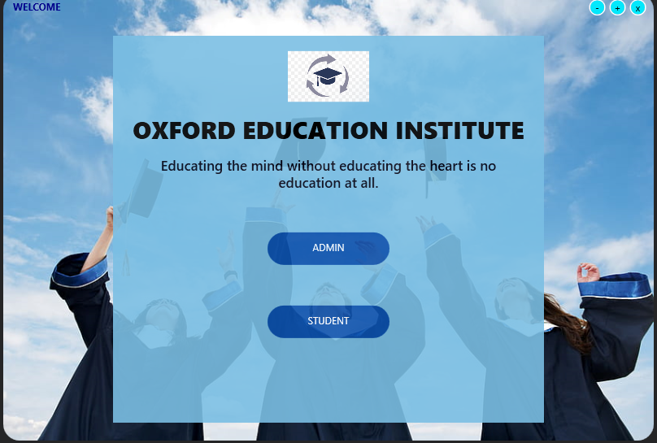
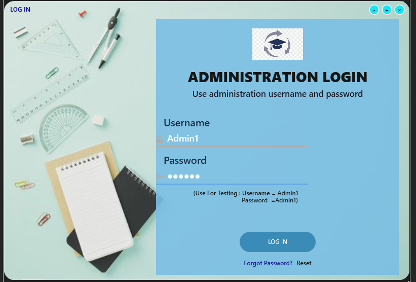
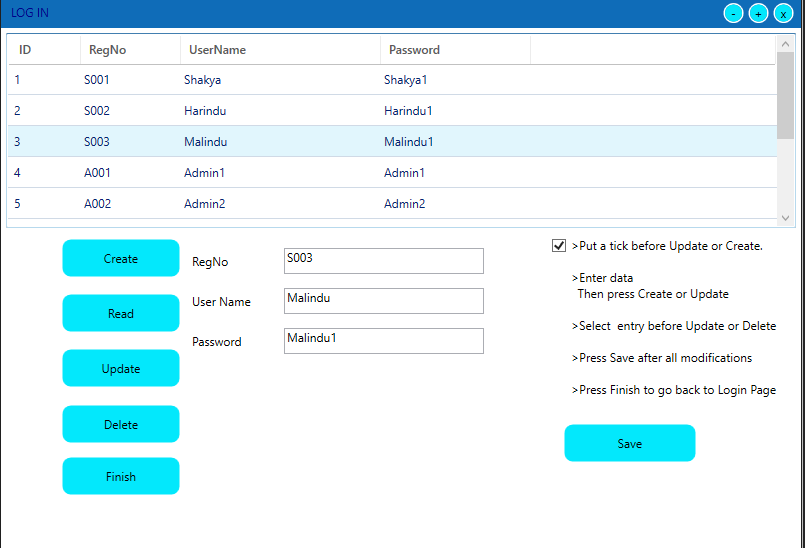
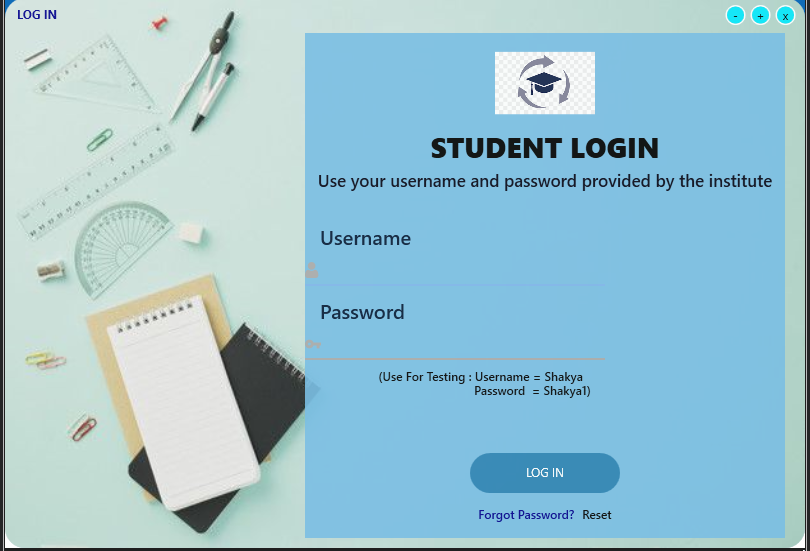
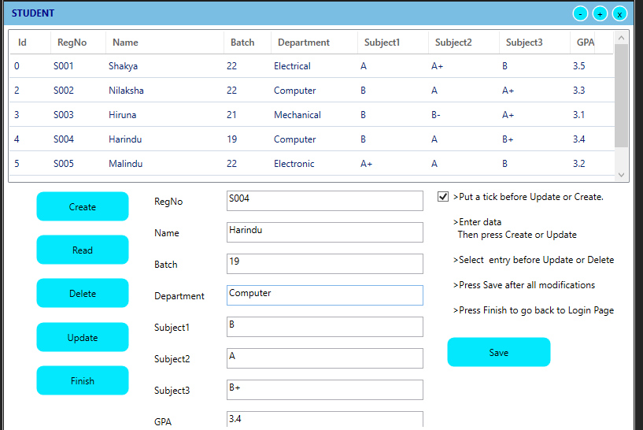

# Student Management System

The Student Management System is a C# WPF application developed using the MVVM architecture. It provides separate access for students and administrators, allowing administrators to manage user accounts and students to handle their results and bio data.

## Features

- **User Roles:**
  - *Admin:* Manages user accounts (create usernames and passwords).
  - *Student:* Adds and handles academic results and bio data.

- **CRUD Operations:**
  - *Admin:*
    - Create, Read, Update, and Delete user accounts.
  - *Student:*
    - Add, view, update, and delete academic results and bio data.

## Technologies Used

- C# WPF (Windows Presentation Foundation)
- MVVM (Model-View-ViewModel) Architecture
- SQLite for Database Handling
- 
Usage:

On the login screen, administrators can use their credentials to access the admin panel.
Students can use their credentials to access the student dashboard.

